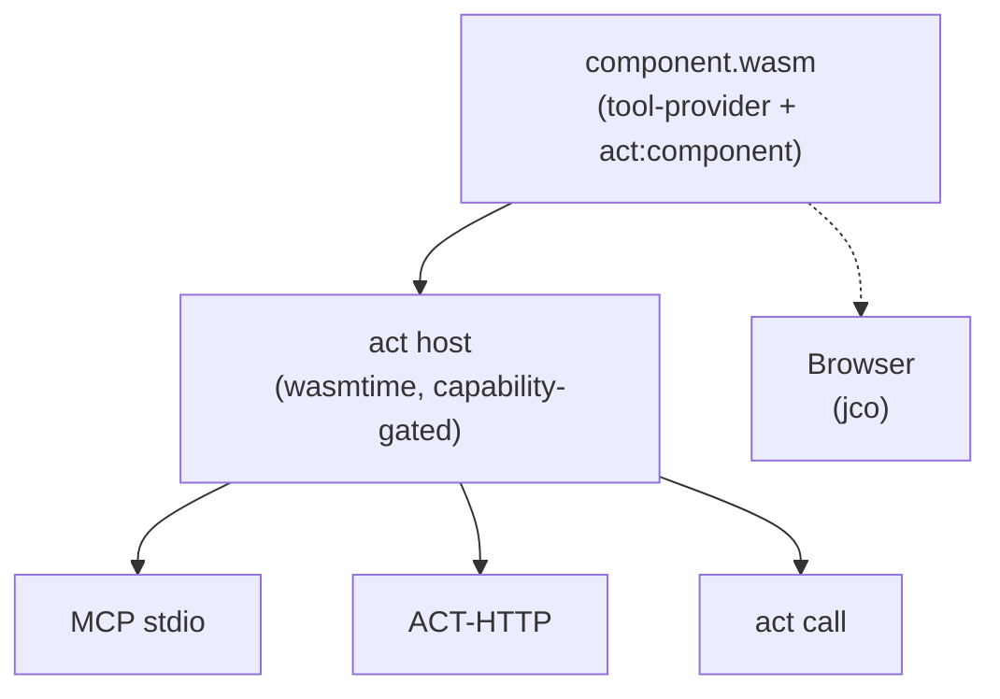

ACT — *Agent Component Tools* — is a protocol for packaging tools as WebAssembly components. One `.wasm` file works from any host: agents via MCP, applications via HTTP, developers via CLI, browsers via jco.

## Why another protocol

Tools today are scattered across MCP servers, OpenAPI backends, ad-hoc REST APIs, and language-specific SDKs. Each target needs its own adapter, its own auth story, its own sandbox. ACT collapses the pipeline:

| Problem | ACT |
|---|---|
| One codebase per transport (MCP server, REST backend, CLI) | One `.wasm`, four transports (MCP, HTTP, CLI, browser) |
| Tools run with full OS access | Deny-by-default filesystem + network sandbox; capabilities are declared in the component and intersected with host policy |
| Metadata drift across `Cargo.toml` / `pyproject.toml` / `package.json` | Merged at build time into a signed `act:component` custom section |
| "Works on my machine" | Deterministic `.wasm` binary — same SHA256 on any CPU, any host, any transport |

## Architecture in one picture

A component exports the `tool-provider` interface from [`act:core@0.3.0`](https://github.com/actcore/act-spec/blob/main/wit/act-core.wit). The host reads the component's metadata from a WASM custom section (`act:component`, CBOR) without instantiating it, then exposes the tools over any of four transports.

## What's in the box

- **`act`** — host CLI. Pulls components from OCI registries, HTTP URLs, or local paths; runs them as MCP server, HTTP server, or direct-call.
- **`act-build`** — component post-processor. Merges metadata from `Cargo.toml` / `pyproject.toml` / `package.json` / `act.toml` into the `.wasm`.
- **`act-sdk` (Rust)** — `#[act_component]` / `#[act_tool]` macros.
- **`act-sdk` (Python)** — `@component` / `@tool` decorators via `componentize-py`.
- **Spec** — [`actcore/act-spec`](https://github.com/actcore/act-spec). WIT is normative; JSON Schema is derived.
- **Components** — a growing set under [`ghcr.io/actpkg`](https://github.com/orgs/actpkg/packages): `sqlite`, `http-client`, `crypto`, `encoding`, `filesystem`, `openwallet`, `python-eval`, `mcp-bridge`, `openapi-bridge`, `random`, `time`.

## Next

- [Install](/docs/install/)
- [Run your first component](/docs/run-first-component/) (pull + serve + call in under a minute)
- [Build your own](/docs/build/rust/) — Rust or Python
